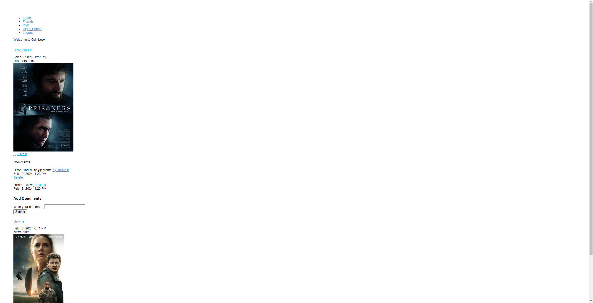
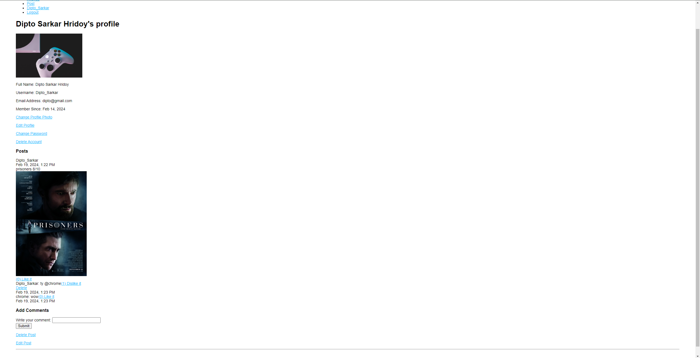

# Odin Book SSR

Odin Book SSR is a social media application built with Node.js, Express, and MongoDB. It uses server-side rendering with Pug as the template engine. The application allows users to create an account, add friends, and post updates. The application is built as part of the curriculum for The Odin Project. Live demo https://odin-book-33en.onrender.com.
If this link takes too long to load, try this one https://odin-book-ssr.adaptable.app/

## Features

- User authentication and profile management
- Friend requests and friend list management
- Posting updates with optional image attachments
- Commenting on posts
- Liking posts, comments
- Edit and delete posts, comments

## Screenshots




## Future Features

- Implement real-time notification updates with Socket.IO
- Implement real-time chatting functionality
- Integrate a frontend framework like React or MarkoJS for enhanced UI and interactivity
- Improve the visual appeal with CSS styling to make the application look good
- Improve the error handling

## Installation

1. Clone the repository
2. Install dependencies
   ```sh
   npm install
   ```
3. Create a `.env` file in the root directory and add the following environment variables
   ```sh
    MONGODB_URI=your_mongodb_uri
    SESSION_SECRET=your_session_secret
    CLOUDINARY_NAME=your_cloudinary_name
    CLOUDINARY_API_KEY=your_cloudinary_api_key
    CLOUDINARY_API_SECRET=your_cloudinary_api_secret
    ```
4. Start the server
    ```sh
    npm run dev
    ```
5. Open your browser and navigate to `http://localhost:3000`


